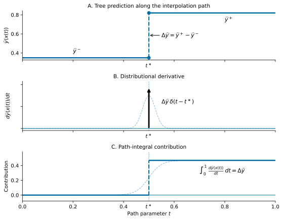

# TreeIG

[](https://pypi.org/project/treeig/)

TreeIG computes exact Integrated Gradients for tree-based models. It decomposes the change in a fitted tree model's scalar output between a baseline input $x_0$ and an observation $x$ into additive feature contributions.

For each observation, TreeIG returns feature attributions $\phi_j$ satisfying

$$\sum_j \phi_j = F(x) - F(x_0),$$

where $F$ is the scalar model output being explained. For regression models, $F$ is the prediction. For supported classifiers, $F$ is the raw margin/logit, not the predicted probability.

Integrated Gradients (Sundararajan, Taly, and Yan, 2017) defines feature attributions by integrating model gradients along a straight-line path from a baseline $x_0$ to the observation $x$.

At first glance, Integrated Gradients appears mismatched with piecewise-constant tree models: gradients vanish almost everywhere and are undefined at split boundaries. [Hentschel (2026)](https://www.ludgerhentschel.com/PDFs/Hentschel%20'26g.pdf) shows that, for tree-based models, the path-integral of the gradients reduces to the sum of prediction jumps at split boundaries crossed along the integration path. The resulting attribution is exact — no Monte Carlo sampling, no numerical quadrature, no approximation parameters.

Because TreeIG replaces numerical quadrature and sampling with a finite sum over split crossings, it is fast in practice. For many real-world models — hundreds of trees, hundreds of features — attribution over thousands of observations completes in a few milliseconds on a modern laptop. (See the [example notebook](examples/) for timings.) For many typical use cases TreeIG is competitive with, and often faster than, TreeSHAP, which is itself considered fast.

TreeIG also includes [TreeIGNumeric](#treeignumeric), a model-agnostic fallback that recovers the same crossing-sum attribution through numerical event detection when exact structural support is unavailable.

## Recommended baseline construction

For Integrated Gradients, the baseline determines the prediction contrast
being explained. **[CBaseline](https://github.com/lhentschel/cbaseline) is the
preferred way to construct TreeIG baselines.** It produces empirical,
prediction-neutral baseline distributions whose weighted mean model output is
the chosen reference prediction. TreeIG then explains the model prediction
relative to that reference level rather than relative to an arbitrary feature
vector such as the feature-wise mean.

TreeIG accepts a CBaseline `Background` directly and evaluates its weighted
baseline paths efficiently. See CBaseline for construction choices and the
interpretation of the reference prediction `f0`.

## Installation

```bash
pip install treeig
pip install cbaseline  # recommended baseline construction
pip install "treeig[catboost]"  # optional numerical CatBoost support
```

Requires Python ≥ 3.9, NumPy, and Numba. Model backends (scikit-learn,
XGBoost, LightGBM, and CatBoost) are not installed automatically; install
whichever you use.

## Quickstart

```python
import numpy as np
import treeig as tig

# model is a fitted supported tree model
x0 = X_train.mean(axis=0)
X_eval = X_test[:100]

ig = tig.TreeIG(model, baseline=x0)
phi = ig.attribute(X_eval)
```

For libraries integrating TreeIG, the public adapter surface also includes:

```python
tig.supports(model)                       # exact backend availability
ig.model_output(X_eval)                   # scalar output being attributed

numeric = tig.TreeIGNumeric(model, baseline=x0)
numeric.model_output(X_eval)              # numeric backend output scale
```

The single-vector example above is the minimal API. For substantive
attribution, prefer a prediction-neutral distribution constructed with
[CBaseline](https://github.com/lhentschel/cbaseline).

Weighted baseline distributions are first-class baselines. Pass either a
matrix and aligned weights or a CBaseline `Background` directly:

```python
ig = tig.TreeIG(model, baseline=background)  # uses .rows and .weights
phi = ig.attribute(X_eval)

# Equivalent explicit form; weights are normalized internally.
phi = ig.attribute(
    X_eval,
    baseline=background.rows,
    baseline_weights=background.weights,
    baseline_batch_size=25,
)
```

TreeIG preserves each baseline-specific path and performs the weighted
aggregation inside a compiled loop. With `return_by_baseline=True`,
`attribute` returns `(weighted, by_baseline)` for diagnostics.

Compiled baseline traversal is also used by `loss_attribution` and
`multiclass_loss_attribution`. For multiclass log
loss, TreeIG merges class-score events in chronological path order before
applying each softmax-loss change. Pass the complete baseline distribution in
one call instead of invoking the explainer once per baseline: this amortizes
tree parsing and model dispatch and keeps baseline aggregation inside compiled
code.

`phi` has the same shape as `X_eval`. Row `i`, column `j` is the contribution
of feature `j` to the model-output change from `x_0` to `X_eval[i]`.

For regression models, the completeness property holds exactly:

```python
np.testing.assert_allclose(
    phi.sum(axis=1),
    model.predict(X_eval) - model.predict(x0.reshape(1, -1))[0],
)
```

## Why TreeIG?

Standard Integrated Gradients defines feature contributions by integrating
model gradients along a straight-line path from a baseline input to the
observation. Tree models are piecewise constant, so ordinary gradients are
zero almost everywhere and undefined at split boundaries.

TreeIG uses the tree structure directly. Along the interpolation path

$$ x(t) = x_0 + t\,(x - x_0),\qquad 0 \le t \le 1, $$

a tree prediction changes only when the path crosses a split threshold.
TreeIG finds those crossings exactly and assigns each prediction jump to the
feature responsible for the crossing. For ensembles, contributions are summed
across trees. The result is an exact additive decomposition without numerical
quadrature.

The distributional-derivative perspective makes this precise. Along the
interpolation path the prediction is piecewise constant, and its generalized
derivative is a sum of localized impulses at split crossings. The path integral
of each impulse is exactly the prediction jump at that crossing.

<p align="center">
  
</p>

The top panel shows a step in the tree prediction along the interpolation path. The middle panel shows the corresponding distributional derivative: zero everywhere except at the split crossing. (Here, $\delta(t - t^\ast)$ is the Dirac delta distribution centered at $t^\ast$.) The bottom panel shows that the path integral localizes exactly at the crossing and recovers the prediction jump. TreeIG exploits the fact that integrated gradients applied to trees requires neither numerical differentiation nor numerical integration; it reduces to a simple sum of prediction steps along the integration path $x(t)$.

Standard numerical Integrated Gradients methods try to approximate these impulses using dense interpolation grids. TreeIG instead computes the split-crossing contributions analytically from the fitted tree structure. In this sense, TreeIG plays a role analogous to automatic differentiation for smooth models: rather than numerically searching for discontinuities, it uses the model's computational structure to evaluate the attribution integral exactly and efficiently. (The analogy understates the gain. Automatic differentiation removes derivative approximation but not the numerical quadrature used by Integrated Gradients. TreeIG exploits tree structure to evaluate the attribution integral itself exactly.)

## Supported models

TreeIG currently supports tree models with finite numeric feature inputs.

### Regression

- `sklearn.tree.DecisionTreeRegressor`
- `sklearn.ensemble.RandomForestRegressor`
- `sklearn.ensemble.ExtraTreesRegressor`
- `sklearn.ensemble.GradientBoostingRegressor`
- `xgboost.XGBRegressor`
- `xgboost.Booster`
- `lightgbm.LGBMRegressor`
- `lightgbm.Booster`

### Classification (raw margins/logits only)

- `sklearn.ensemble.GradientBoostingClassifier`
- `xgboost.XGBClassifier`
- `lightgbm.LGBMClassifier`

For classification models, TreeIG attributes raw margins or logits. It does not
attribute predicted probabilities because these are not additive across trees.

TreeIG computes exact path decompositions directly from the fitted tree
structure. Since tree representations differ substantially across
implementations, each model family requires customized parsing and routing
logic.

### Exact support not currently available

The exact TreeIG parser does not currently support:

- CatBoost;
- categorical splits;
- missing-value routing (use feature augmentation for missingness);
- probability-output attribution (because probability attribution is not additive);
- probability-averaging or vote-share classifiers such as
  `DecisionTreeClassifier`, `RandomForestClassifier`, and
  `ExtraTreesClassifier` (because they produce probabilities, not scores).

Many of these can still be attributed with the model-agnostic
[TreeIGNumeric](#treeignumeric), described below.

## TreeIGNumeric

TreeIGNumeric is a model-agnostic fallback that recovers the crossing-sum
attribution by numerically detecting prediction discontinuities along the
integration path. It requires no access to model internals — only repeated
evaluations of the prediction function — so it applies to many
piecewise-constant models the exact parser does not support. Whenever a
supported backend is available, exact TreeIG should be preferred.

TreeIGNumeric scans a numerical grid along the integration path to locate
changes in the prediction, then uses local axis-aligned probes at each detected
change to attribute the step to a feature. It preserves completeness for the
detected changes and typically produces attributions very similar to exact
TreeIG. Because it locates crossings numerically, multiple nearby crossings may
occasionally be merged into a single event; exact TreeIG avoids this by
enumerating crossings directly from the tree structure.

Two caveats on coverage:

- **CatBoost and other encoded models.** TreeIGNumeric removes the *parsing*
  barrier, but not the modeling one: interpolating a *native* categorical
  feature along the straight-line path is not meaningful, which is a property of
  Integrated Gradients itself, not of the implementation. TreeIGNumeric works on
  CatBoost (and similar) models with numeric or one-hot-encoded inputs.
- **Probability-averaging classifiers.** For models without an additive score
  (e.g. `RandomForestClassifier`), TreeIGNumeric explains a class *probability*,
  so completeness holds in probability space:
  $\sum_j \phi_j = p(x) - p(x_0)$.

```python
import treeig as tig

ig = tig.TreeIGNumeric(model, baseline=x0)
phi, infos, summary = ig.explain(X_eval)
output = ig.model_output(X_eval)

print(summary["mean_abs_residual"])
```

## Diagnostics

Use `explain` when you want attributions together with completeness
diagnostics.

```python
ig = tig.TreeIG(model, baseline=x0)
phi, infos, summary = ig.explain(X_eval)

print(summary)
```

Each entry in `infos` contains diagnostics for one observation:

```python
{
    "n_events":        ...,   # number of split-crossing events
    "endpoint_delta":  ...,   # F(x) - F(x0)
    "attribution_sum": ...,   # sum_j phi_j
    "residual":        ...,   # attribution_sum - endpoint_delta
    "abs_residual":    ...,
}
```

TreeIGNumeric returns the same fields plus `n_coincident_events`, the number of
events at which multiple crossings were merged and allocated by the fallback
rule. The `summary` dictionary reports aggregate residual and event-count
statistics.

## Classification targets

For binary additive-score classifiers, `target=None` and `target=1` both
attribute the positive-class margin. `target=0` attributes the negative margin,
implemented as the negative of the positive-class margin.

```python
ig = tig.TreeIG(model, baseline=x0, target=1)
phi_pos = ig.attribute(X_eval)

ig = tig.TreeIG(model, baseline=x0, target=0)
phi_neg = ig.attribute(X_eval)
```

For multiclass classifiers, pass the class index explicitly.

```python
ig = tig.TreeIG(model, baseline=x0, target=2)
phi_class_2 = ig.attribute(X_eval)
```

TreeIG attributes raw class margins. If probability-space explanations are
needed, users should transform or interpret the margin-level contributions
separately.

## Functional interface

TreeIG also provides a direct functional interface.

```python
phi, infos, summary = tig.compute(
    model,
    baseline=x0,
    X=X_eval,
)
```

## Warmup

TreeIG uses Numba for fast parallel attribution kernels. The first call
includes JIT compilation. You can compile in advance with `warmup`:

```python
ig = tig.TreeIG(model, baseline=x0).warmup(X_eval[:3])
phi = ig.attribute(X_eval)
```

Subsequent calls on the same model are fast. Attribution for thousands of
observations on a typical ensemble completes in well under a second after
warmup.

## Numerical conventions

TreeIG follows each backend's split-routing convention as closely as possible.

- scikit-learn trees route left when `x[j] <= threshold`;
- LightGBM numeric splits route left when `x[j] <= threshold`;
- XGBoost numeric splits route left when `x[j] < threshold`
  using float32-style comparisons.

Inputs must be finite numeric arrays. Missing-value routing is not currently
implemented, so `NaN` and `Inf` values raise errors.

## Baselines

The baseline $x_0$ defines the reference point for the decomposition. Common
choices include the training-sample mean, a median or representative
observation, a domain-specific neutral input, or a fixed benchmark case.

The attribution always explains the difference between the model output at the
observation and the model output at the chosen baseline. Different baselines
answer different questions.

## Interpretation

For an observation $x$, TreeIG reports how much each feature contributes to
moving the model output from $F(x_0)$ to $F(x)$ along the straight-line path
from $x_0$ to $x$. Positive contributions increase the scalar output relative
to the baseline; negative contributions decrease it. The contributions are
additive by construction.

## Relation to SHAP and TreeSHAP

TreeIG and TreeSHAP answer different attribution questions and generally produce
different decompositions. Neither dominates the other.

**TreeIG** answers: "How much does feature $j$ contribute to the change in
prediction as we move continuously from baseline $x_0$ to observation $x$?" The
attribution is the integral of partial derivatives along the path from $x_0$ to
$x$, which for piecewise-constant trees reduces exactly to a sum of prediction
jumps at the split boundaries crossed along the path.

**TreeSHAP** answers: "How much does feature $j$ shift the expected prediction,
averaged over all possible subsets of the other features?" The attribution is an
average of discrete inclusion effects, where absent features are marginalized
out over a background dataset. There is no path; the reference is the expected
prediction over the background distribution.

The two differ in two ways. First, TreeIG takes a specific baseline input $x_0$
as its reference, while TreeSHAP uses a background distribution. Second, TreeIG
measures contributions through calculus — integrating how the prediction changes
as features move continuously from their baseline values — while TreeSHAP
measures them through discrete feature inclusion, asking how much each feature
changes the expected prediction when it enters a coalition.

The practical consequence is one of scope. SHAP's coalition construction is
indifferent to the prediction surface between the background and the
observation: a feature is either in the coalition or out, so the attribution is
built from discrete switches and explores a wide neighborhood of hybrid inputs,
many far from any natural path between real observations. IG instead follows a
single path and accumulates exactly the prediction changes along it, evaluating
the model only at convex combinations of two real inputs. SHAP explores a
neighborhood; IG traces a path. SHAP's breadth gives sensitivity to model
behavior across many feature combinations; IG's specificity gives a precise
account of one trajectory through input space.

For a linear model with independent features and $x_0$ equal to the background
mean, TreeIG and interventional SHAP coincide. (A linear model is not a tree, so
the comparison is to SHAP generally rather than to TreeSHAP.) As the model
becomes more nonlinear or the baseline $x_0$ diverges from the background
distribution, the two increasingly disagree — reflecting genuine differences in
the questions they answer rather than errors in either method.

## Examples

### XGBoost regression

```python
import numpy as np
import xgboost as xgb
import treeig as tig

model = xgb.XGBRegressor(
    n_estimators=100,
    max_depth=3,
    learning_rate=0.05,
    objective="reg:squarederror",
    random_state=0,
)
model.fit(X_train, y_train)

x0 = X_train.mean(axis=0)
X_eval = X_test[:100]

ig = tig.TreeIG(model, baseline=x0).warmup(X_eval[:3])
phi, infos, summary = ig.explain(X_eval)

print(phi.shape)
print(summary["max_abs_residual"])
```

### Multiclass classification margins

```python
import lightgbm as lgb
import treeig as tig

model = lgb.LGBMClassifier(...)
model.fit(X_train, y_train)

x0 = X_train.mean(axis=0)
X_eval = X_test[:100]

# Attribute class-2 raw margin
ig = tig.TreeIG(model, baseline=x0, target=2)
phi = ig.attribute(X_eval)
```

### Model-agnostic attribution

```python
import treeig as tig

ig = tig.TreeIGNumeric(model, baseline=x0)
phi, infos, summary = ig.explain(X_eval)

print(summary["mean_abs_residual"])
```

## Project status

TreeIG is production-ready for exact attribution of supported tree models in raw-output space. The current release covers the dominant tree ensemble backends in the Python ecosystem. TreeIGNumeric provides a model-agnostic fallback for unsupported piecewise-constant models.

Future extensions may include:

- exact structural support for CatBoost and other currently unsupported tree implementations;
- customized handling of categorical split structures and missing-value routing;
- alternative allocation rules for simultaneous multi-feature effects at coincident crossings.

## Citation

If you use TreeIG in your work, please cite:

```bibtex
@misc{hentschel2026treeig,
  author = {Hentschel, Ludger},
  title  = {{TreeIG}: Exact Integrated Gradients for Tree-Based Models},
  year   = {2026},
  url    = {https://www.ludgerhentschel.com/PDFs/Hentschel%20'26g.pdf},
}
```

## License

TreeIG is released under the terms in [LICENSE](LICENSE).

## References

TreeIG:

- Hentschel, Ludger. 2026.
  ["TreeIG: Exact Integrated Gradients for Tree-Based Models."](https://www.ludgerhentschel.com/PDFs/Hentschel%20'26g.pdf)
  *https://www.ludgerhentschel.com/Research.html* and *https://www.ludgerhentschel.com/Programs.html*

Integrated Gradients:

- Sundararajan, Mukund, Ankur Taly, and Qiqi Yan. 2017.
  "Axiomatic Attribution for Deep Networks."
  *International Conference on Machine Learning (ICML)*.

SHAP and TreeSHAP:

- Lundberg, Scott M., and Su-In Lee. 2017.
  "A Unified Approach to Interpreting Model Predictions."
  *Advances in Neural Information Processing Systems (NeurIPS)*.

- Lundberg, Scott M., Gabriel Erion, and Su-In Lee. 2020.
  "From Local Explanations to Global Understanding with Explainable AI for Trees."
  *Nature Machine Intelligence*.

Popular implementations of Integrated Gradients for smooth models:

- Captum for PyTorch: https://captum.ai/
- TensorFlow Integrated Gradients: https://www.tensorflow.org/tutorials/interpretability/integrated_gradients
